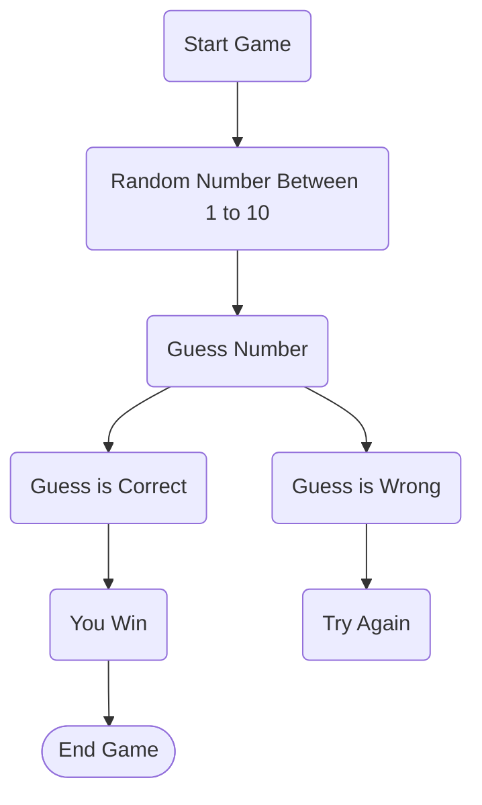

# Number Guessing Game
Number Guessing Game

```mermaid
flowchart TD
   Start(Start Game)
    --> B(Random Number Between 1 to 10)
    B --> C(Guess Number)
    C --> D(Guess is Correct)
    C --> E(Guess is Wrong)
    D--> F(You Win)
-->End([End Game])
    E --> H(Try Again)
    
```
